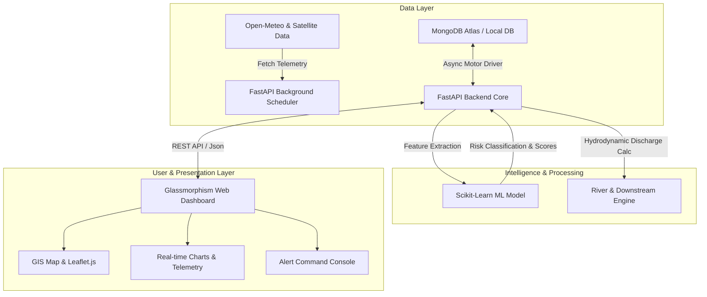

# 🏔️ GLOF Sentinel — Early Warning System for Glacial Lake Outburst Floods

[](https://www.python.org/)
[](https://fastapi.tiangolo.com/)
[](https://www.mongodb.com/)
[](https://scikit-learn.org/)
[]()

> **GLOF Sentinel** is a state-of-the-art, real-time AI-powered early warning and disaster mitigation platform designed to monitor high-risk glacial lakes, predict Glacial Lake Outburst Floods (GLOF), simulate downstream hydrodynamic impacts, and dispatch automated multi-channel emergency alerts to vulnerable communities.

---

## 📋 Table of Contents

- [Overview](#-overview)
- [Key Features](#-key-features)
- [System Architecture](#-system-architecture)
- [Tech Stack](#-tech-stack)
- [Quick Start Guide (Local Setup)](#-quick-start-guide-local-setup)
  - [1. Prerequisites](#1-prerequisites)
  - [2. Clone Repository](#2-clone-repository)
  - [3. Environment Setup](#3-environment-setup)
  - [4. Install Dependencies](#4-install-dependencies)
  - [5. Seed Initial Database](#5-seed-initial-database)
  - [6. Run the Application](#6-run-the-application)
- [Environment Configuration](#-environment-configuration)
- [Machine Learning Engine](#-machine-learning-engine)
- [API Documentation](#-api-documentation)
- [Project Directory Structure](#-project-directory-structure)
- [Deployment Guide](#-deployment-guide)
- [Troubleshooting](#-troubleshooting)
- [Contributing](#-contributing)

---

## 🌟 Overview

Glacial Lake Outburst Floods (GLOFs) represent one of the most critical climate-induced hazards across high-altitude regions such as the Himalayas, Andes, and Tien Shan. Sudden moraine dam breaches can release millions of cubic meters of water within hours, causing catastrophic loss of life and infrastructure downstream.

**GLOF Sentinel** addresses this challenge by fusing:
- **Satellite & Telemetry Data**: Automated background polling for real-time weather and glacial lake expansion metrics.
- **Machine Learning Hazard Classification**: Random Forest risk modeling scoring breach probability in real-time.
- **Hydrodynamic Wave Propagation**: Downstream peak flood arrival calculations and population exposure mapping.
- **Modern Interactive Dashboard**: Premium glassmorphism GIS map interface providing actionable intelligence to emergency command centers.

---

## ✨ Key Features

- 🌊 **Glacial Lake Intelligence**: Live tracking of water surface area, volume expansion rates, freeboard depth, and moraine stability indices.
- 🤖 **Predictive Machine Learning**: Real-time risk evaluation (`LOW`, `MODERATE`, `HIGH`, `CRITICAL`) using trained Scikit-Learn ensembles.
- ⚡ **Multi-Channel Alert Dispatch**: Dynamic alarm engine generating community evacuation warnings and escalating alert statuses.
- 🌊 **River & Hydrodynamic Simulation**: Downstream flow discharge modeling, peak arrival time estimates, and river basin vulnerability analysis.
- 🛰️ **Automated Background Telemetry**: Integrated `APScheduler` background service fetching live historical and forecast weather parameters.
- 📜 **Glacial Lake Inventory**: Comprehensive database of major high-risk glacial lakes (e.g., South Lhonak, Imja Tsho, Thorthormi Tsho, Palcacocha).
- 📊 **Historical Disaster Analytics**: Comparative analytical dashboard correlating historical outburst events with current hazard trends.

---

## 🏗️ System Architecture



---

## 💻 Tech Stack

| Domain | Technology | Description |
| :--- | :--- | :--- |
| **Backend Framework** | [FastAPI](https://fastapi.tiangolo.com/) | Asynchronous, high-performance Python web framework |
| **Database** | [MongoDB](https://www.mongodb.com/) + [Motor](https://motor.readthedocs.io/) | NoSQL Document Store with async Python driver |
| **Machine Learning** | [Scikit-Learn](https://scikit-learn.org/), [Pandas](https://pandas.pydata.org/) | Random Forest Classifier for hazard risk prediction |
| **Task Scheduler** | [APScheduler](https://apscheduler.readthedocs.io/) | Automated background telemetry polling & simulations |
| **Frontend** | HTML5, Vanilla JavaScript (ES6+), CSS3 | High-performance Glassmorphism UI with smooth animations |
| **Visualization** | Leaflet.js, Chart.js, FontAwesome | Spatial geospatial mapping & real-time telemetry charts |
| **Deployment** | [Render](https://render.com/) (Backend) / [Vercel](https://vercel.com/) (Frontend) | Cloud server & static site hosting ready |

---

## 🚀 Quick Start Guide (Local Setup)

Follow these simple step-by-step instructions to get **GLOF Sentinel** running locally on your machine.

### 1. Prerequisites

Ensure you have the following installed on your system:
- **Python**: Version `3.10` or `3.11` ([Download Python](https://www.python.org/downloads/))
- **Git**: ([Download Git](https://git-scm.com/))
- **MongoDB**: A running local MongoDB instance (`mongodb://localhost:27017`) OR a free [MongoDB Atlas Cloud Cluster](https://www.mongodb.com/cloud/atlas).

---

### 2. Clone Repository

Open your terminal / command prompt and run:

```bash
git clone https://github.com/selvamani-123/Early-Warning-System-for-Glacial-Lake-Outburst-Flood--GLOF.git
cd Early-Warning-System-for-Glacial-Lake-Outburst-Flood--GLOF
```

---

### 3. Environment Setup

Navigate to the `Backend` directory and create your environment configuration file (`.env`):

#### On Windows (Command Prompt / PowerShell):
```cmd
cd Backend
copy .env.example .env
```
*(If `.env.example` is not present, manually create a `.env` file in the `Backend` folder).*

#### On macOS / Linux:
```bash
cd Backend
touch .env
```

Add the following contents to `Backend/.env`:

```env
# MongoDB Connection String (Atlas URI or Local MongoDB)
MONGODB_URI=mongodb://localhost:27017
DB_NAME=glof_sentinel
ENVIRONMENT=development

# Allowed CORS Origins (Comma-separated)
ALLOWED_ORIGINS=http://localhost:8000,http://127.0.0.1:8000,http://localhost:3000
```

> **Note**: You can use your MongoDB Atlas connection string in place of `mongodb://localhost:27017` if using a cloud database.

---

### 4. Install Dependencies

It is recommended to set up a virtual environment:

#### On Windows:
```cmd
python -m venv venv
venv\Scripts\activate
pip install -r requirements.txt
```

#### On macOS / Linux:
```bash
python3 -m venv venv
source venv/bin/activate
pip install -r requirements.txt
```

---

### 5. Seed Initial Database

Populate your database with curated real-world glacial lake telemetry (South Lhonak, Imja Tsho, Thorthormi, Palcacocha, etc.), historical GLOF records, and river basin structures:

```bash
python -m app.scripts.seed_db
```

---

### 6. Run the Application

Start the FastAPI server. By default, FastAPI automatically mounts and serves the web frontend!

```bash
uvicorn main:app --host 0.0.0.0 --port 8000 --reload
```

#### 🌐 Accessing the System:
- **Web Dashboard & Command Console**: Open `http://localhost:8000` in your web browser.
- **Interactive API Swagger Docs**: Open `http://localhost:8000/docs`
- **ReDoc API Specifications**: Open `http://localhost:8000/redoc`

---

## ⚙️ Environment Configuration

| Variable | Type | Default Value | Description |
| :--- | :--- | :--- | :--- |
| `MONGODB_URI` | `string` | `mongodb://localhost:27017` | MongoDB connection URI (Local or Atlas) |
| `DB_NAME` | `string` | `glof_sentinel` | Name of the database store |
| `ENVIRONMENT` | `string` | `development` | Deployment mode (`development` or `production`) |
| `ALLOWED_ORIGINS` | `string` | `http://localhost:8000,...` | CORS cross-origin permitted URLs |

---

## 🤖 Machine Learning Engine

The system features an integrated machine learning workflow located in `Backend/offline_training/`:

1. **Dataset Generation**: Synthesizes glaciological, meteorological, and dam-stability parameters (`dataset_builder.py`).
2. **Feature Engineering**: Computes volume-area ratios, temperature anomalies, and freeboard safety margins (`feature_engineering.py`).
3. **Model Training**: Trains a Random Forest Classifier outputting model binary `glof_model.pkl` and feature rankings (`train_model.py`).

To re-train the model offline:
```bash
cd Backend
python offline_training/train_model.py
```

---

## 📡 API Documentation

Key API endpoints served at `/api/v1`:

| Endpoint Route | Method | Description |
| :--- | :--- | :--- |
| `GET /health` | `GET` | System health check and API version status |
| `GET /api/v1/lake/lakes` | `GET` | List all monitored glacial lakes and live metrics |
| `GET /api/v1/lake/lakes/{id}` | `GET` | Detailed telemetry and risk profile for a specific lake |
| `GET /api/v1/analytics/predict/{id}` | `GET` | Trigger ML hazard prediction for a target glacial lake |
| `GET /api/v1/river/rivers` | `GET` | Hydrodynamic river basin discharge data |
| `GET /api/v1/monitoring/sensors` | `GET` | Real-time IoT sensor telemetry and satellite feeds |
| `GET /api/v1/alerts/active` | `GET` | Currently active multi-tiered GLOF emergency warnings |
| `POST /api/v1/alerts/dispatch` | `POST` | Trigger emergency alert dispatch to downstream channels |
| `GET /api/v1/history/events` | `GET` | Historical GLOF disaster records & impact data |

For complete interactive endpoint testing, launch the server and visit [http://localhost:8000/docs](http://localhost:8000/docs).

---

## 📁 Project Directory Structure

```
GLOF Sentinel/
├── Backend/
│   ├── app/
│   │   ├── api/          # REST API endpoints & routes (v1)
│   │   ├── core/         # DB connection & app config settings
│   │   ├── models/       # Pydantic domain models & schemas
│   │   ├── scripts/      # Database seeding scripts (seed_db.py)
│   │   ├── services/     # Business logic & ML inference engine
│   │   └── tasks/        # APScheduler background automated tasks
│   ├── data/             # Synthetic & historical dataset files
│   ├── models/           # Domain representations
│   ├── offline_training/ # ML training pipelines & feature engineering
│   ├── .env              # Local environment variables configuration
│   ├── glof_model.pkl    # Serialized Random Forest ML model binary
│   ├── main.py           # Application entrypoint & FastAPI instance
│   └── requirements.txt  # Python package dependencies
├── Frontend/
│   ├── js/               # Modular JavaScript API client & interactive logic
│   ├── index.html        # Overview & Dashboard Page
│   ├── lake_intelligence.html    # Glacial Lake Monitoring Dashboard
│   ├── river_intelligence.html   # River Hydrodynamics Page
│   ├── monitoring.html   # Sensor & Satellite Telemetry Page
│   ├── analytics.html    # ML Risk Assessment Page
│   ├── alerts.html       # Emergency Early Warning Console
│   ├── history.html      # Historical GLOF Disaster Analysis
│   ├── registry.html     # Global Glacial Lake Inventory Registry
│   └── vercel.json       # Vercel deployment rewrite rules
├── render.yaml           # Render deployment configuration specification
└── README.md             # Project Master Documentation
```

---

## ☁️ Deployment Guide

### Deploying Backend on Render

1. Connect your GitHub repository to [Render](https://render.com/).
2. Select **New Web Service** and specify `Backend` as the Root Directory.
3. Configure the build & start commands:
   - **Build Command**: `cd Backend && pip install -r requirements.txt`
   - **Start Command**: `cd Backend && uvicorn main:app --host 0.0.0.0 --port $PORT`
4. Add Environment Variables in the Render Dashboard:
   - `MONGODB_URI`: Your MongoDB Atlas URI.
   - `ENVIRONMENT`: `production`
   - `ALLOWED_ORIGINS`: Your Vercel frontend URL.

### Deploying Frontend on Vercel

1. Connect your GitHub repository to [Vercel](https://vercel.com/).
2. Select the `Frontend` directory as the Root Directory.
3. Deploy! The included `vercel.json` will automatically proxy `/api/v1` traffic to your production API.

---

## ❓ Troubleshooting

<details>
<summary><b>1. MongoDB Connection Failure</b></summary>
<p>

- Verify your MongoDB service is running (`mongod` or local MongoDB service).
- If using MongoDB Atlas, verify your IP Address is added to Network Access whitelist (`0.0.0.0/0` for testing).
- Check that `MONGODB_URI` in `Backend/.env` matches your database credentials.
</p>
</details>

<details>
<summary><b>2. ModuleNotFoundError when running scripts</b></summary>
<p>

- Always ensure your virtual environment is activated (`venv\Scripts\activate` or `source venv/bin/activate`).
- Run modules from the `Backend` directory using the `-m` flag (e.g., `python -m app.scripts.seed_db`).
</p>
</details>

<details>
<summary><b>3. Port 8000 Already in Use</b></summary>
<p>

- Specify a different port when launching Uvicorn:
  ```bash
  uvicorn main:app --host 0.0.0.0 --port 8080 --reload
  ```
</p>
</details>

---

## 🤝 Contributing

Contributions are welcome! If you'd like to improve GLOF Sentinel:
1. Fork the repository.
2. Create a feature branch (`git checkout -b feature/AmazingFeature`).
3. Commit your changes (`git commit -m 'Add AmazingFeature'`).
4. Push to the branch (`git push origin feature/AmazingFeature`).
5. Open a Pull Request.

---


<p align="center">
  Made with ❤️ for Disaster Risk Reduction & High-Altitude Environmental Protection.
</p>

